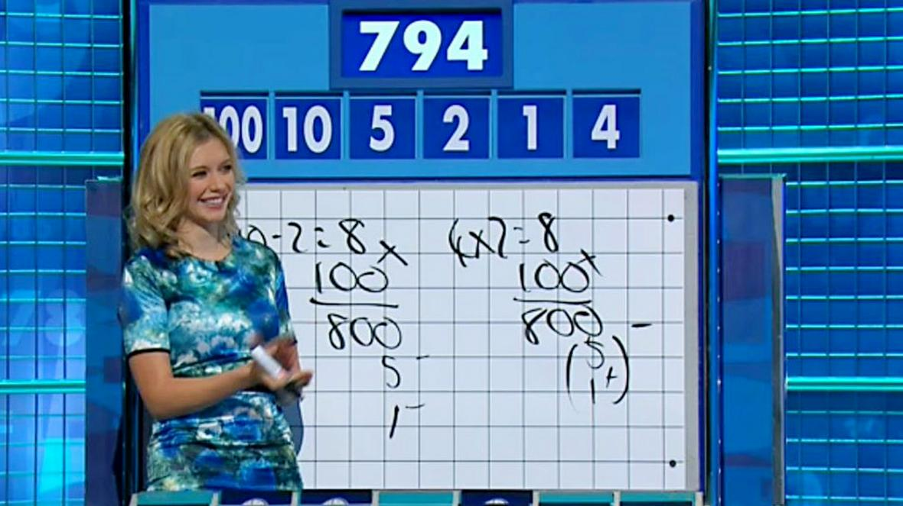

# Countdown Solver in F#

This F# program finds the best solution to a
[Countdown Numbers Game](https://en.wikipedia.org/wiki/Countdown_\(game_show\)#Numbers_round) problem.


[Image Copyright - The Times Newspaper (UK)](https://www.thetimes.co.uk/article/sums-sport-pupils-happy-to-do-maths-ndj20plxw)

## Problem

- 6 numbers are chosen randomly from two sets:
  - up to 4 from the large numbers set `[25,50,75,100]`
  - the remainder from the small numbers set `[1,1,2,2,3,3,4,4,5,5,6,6,7,7,8,8,9,9,10,10]`
- A random 3 digit number from `100-999` is selected
- The 6 numbers should be combined using +,-,*,/ to get as close to the random 3 digit number as possible, ideally exactly
- At no point should the numbers become negative or involve fractions

## Example

Two large numbers `[50;75]` and four small numbers `[2,4,1,4]` are chosen.  
The target number is `178`.  
One solution would be:
- `50 * 2 = 100`
- `100 + 75 = 175`
- `175 + 4 = 179`
- `179 - 1 = 178`

## Solution

The provided solution is as follows:

1. Get all the pairs of numbers from the list of numbers
1. Calculate the results of doing +,-,*,/ on those pairs
1. Add each result to the original set of numbers (with the pair removed)
1. Repeat with the new sets of numbers until no more pairs can be made in each set

Multiple solutions may be found for each target number and then they are ordered on the minimum number of expressions used to get to the target number.
Some targets can't be made exactly from some sets of numbers in which case the closest solution to the target is returned.

## Optimizations

Not all operations apply to all number pairs:
1. `+` is valid for all number pairs.
1. `-` is only useful for numbers that are not equal and can always be ordered so the larger number is on the left and the smaller number on the right, otherwise the result would be negative which isn't allowed.
1. `*` is only useful where one of the numbers isn't `1`.
1. `/` can always be ordered so the larger number is on the left and the smaller number on the right, otherwise the result would be a fraction which isn't allowed. We can also discard divisions that produce a remainder (again resulting in a fraction) and finally this is only useful where the divisor isn't `1`.

`findExactSolution` runs more quickly than `findBestSolution` solution but may not return any solution at all if there is not an exactly solution available. There may also be a solution which uses fewer expressions to reach the target.

## Performance

The three test problems are timed when the program is run. Here are the results from may Windows 10 Ultrabook:
```
570 exact solutions available
Time to try to find exact solution: 00:00:00.1493456
Time to find best solution: 00:00:03.3189662
Target=178, Numbers=[178; 4]
50 * 2 = 100
100 + 75 = 175
175 + 4 = 179
179 - 1 = 178
--------------------------------------------------
11 exact solutions available
Time to try to find exact solution: 00:00:01.2906466
Time to find best solution: 00:00:05.9781165
Target=952, Numbers=[952]
75 * 3 = 225
100 + 6 = 106
106 * 225 = 23850
23850 - 50 = 23800
23800 / 25 = 952
--------------------------------------------------
0 exact solutions available
Time to try to find exact solution: 00:00:00.8824374
Time to find best solution: 00:00:02.8050100
Target=824, Numbers=[826]
3 + 7 = 10
10 * 6 = 60
60 - 1 = 59
59 * 2 = 118
118 * 7 = 826
--------------------------------------------------
```


